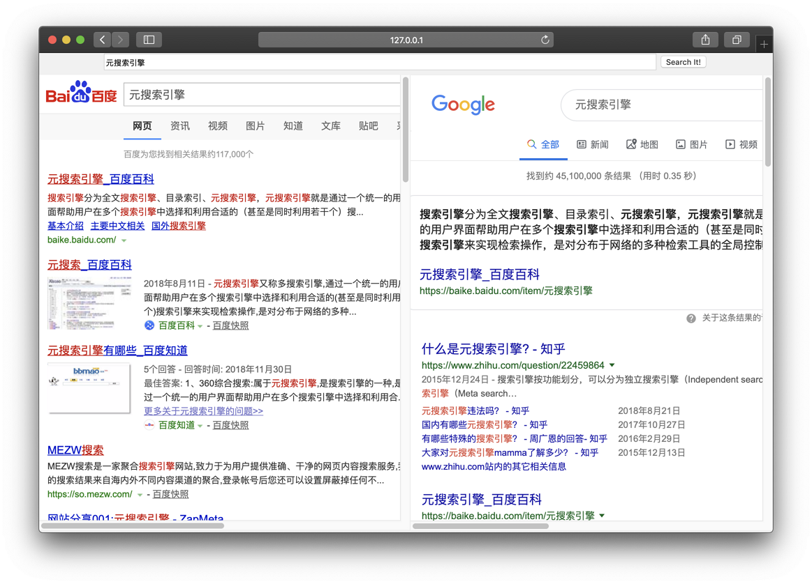

# Search It!

具有反向代理和内容过滤功能的元搜索引擎

Metasearch engine with reverse proxy and output filter features




## 运行环境

### 直接在 php 环境中运行

php 最好安装 [cURL 扩展](http://php.net/manual/zh/book.curl.php) 

把 `www` 目录的内容复制到任意 web 子目录，然后按照下文配置

### docker 直接开放 web 端口

编辑 `docker-compose.yml` 修改端口，用 `docker-compose` 启动

### docker + 反向代理

**VPS 部署推荐方案** 用 apache/nginx 反向代理，实现 HTTPS 访问等效果

编辑 `docker-compose.yml`，只监听 `127.0.0.1`

Apache 开启 mod：

```shell
a2enmod proxy proxy_http headers alias
```

Apache 的配置文件示例：

```
# Searchit, overwrite XFF
Redirect permanent "/mysearch" "/mysearch/"
<Location "/mysearch/">
    ProxyPass "http://127.0.0.1:8080/"
    ProxyPassReverse "http://127.0.0.1:8080/"
    
    ProxyAddHeaders On
    RequestHeader unset X-Forwarded-Host
    RequestHeader unset X-Forwarded-For
    RequestHeader unset X-Forwarded-Server
</Location>
```

### App Engine 云服务

某些 App Engine 功能不全，可能有问题

## 配置

一般地，用户只需要编辑 `www/config.php` 和 `www/engines.d/*.php`

默认配置已经足够完善，以下内容按需配置

### 添加自定义搜索引擎

在 `www/engines.d/` 中仿照原有代码添加搜索引擎的反向代理配置

新增的搜索引擎反向代理配置需要在 `www/config.php` 的 `$proxy_enabled_engines` 中激活

### 修改搜索引擎配置

在 `www/engines.d/` 中找到对应的配置文件，可以修改服务端访问搜索引擎的代理服务器，HTML 过滤函数等

修改 `proxy` 可以修改搜索引擎配置，`type` 支持的所有代理类型见 `www/proxy/curl_search.inc.php`。如果存在 DNS 污染，使用 `socks5h` 等。

只有安装了 `cURL` PHP 扩展才支持代理配置（不想支持 `file_get_contents()` 函数）。 

### 配置浏览器 iframe

在 `www/config.php` 的 `$iframes` 中可以配置浏览器中呈现的 `iframe`

推荐使用 `proxy.php` 通过反向代理间接访问搜索引擎，而不要在浏览器直接请求搜索引擎，否则会有隐私、可用性（GFW、`x-frame-options` 头）等问题。

## 技术细节

### 自动判断 `cURL` 扩展存在 

`www/proxy/proxy.php` 自动判断是否存在 `cURL` 扩展，如果存在则使用之，否则用 `file_get_contents()` 在服务端发出 HTTP 请求

### 反向代理保护隐私

- 通过设置 `Content-Security-Policy` 响应头，阻止浏览器加载搜索引擎页面的任何 JavaScript 代码
- 通过设置 `Referrer-Policy` 响应头，阻止浏览器在访问搜索结果时发送 `Referrer` 请求头
- 通过 `www/engines.d/*.php` 中的 `engine_output_filter()` 函数，尝试对搜索引擎搜索结果URL 解码得到真实 URL，同时删除 `<a>` 标签的 `ping` 属性，防止发送跟踪请求。同时可以修改网页样式，禁用原有的搜索框。

## FAQ

### cURL 证书错误

cURL 使用的来自于 [CA certificates extracted from Mozilla](https://curl.haxx.se/docs/caextract.html) 的根证书 `www/proxy/cert/cacert.pem` 可能已经过期，可以尝试手动更新

### 百度无限刷新

原因可能是 cURL 错误设置 `User-Agent`，或者某些 App Engine 平台的 `file_get_contents()` 无法设置 `User-Agent`。这些情况下，百度根据 `User-Agent` 判断客户端不支持 HTTPS，会返回：

```javascript
location.replace(location.href.replace("https://","http://"));
```

需要正确设置 `User-Agent`，设置为任意桌面端现代浏览器的 `User-Agent` 即可。

如果某些平台无法设置，可以尝试修改搜索引擎的反向代理URL，把 `https://www.baidu.com/` 改为 `http://www.baidu.com/`。

### Google 提示 `需要网站所有者处理的错误：网站密钥的网域无效`

有的网络环境下，通过 IPv6 访问 Google 会提示 `需要网站所有者处理的错误：网站密钥的网域无效`。可以设置 `/etc/hosts` 解决。

### 浏览器前端显示布局异常

鄙人的 HTML/CSS/JavaScript 都是乱写的，只测试了 Chrome 和 Firefox 浏览器，随缘兼容 Safari，不知道怎么兼容 iOS 浏览器，不打算兼容 IE 以及一切杂牌浏览器。如果发现显示问题并且知道怎么改，欢迎指正。

## debug & tests


`www/config.php` 中 debug 相关的变量/常量：

- `SEARCHIT_DEBUG`：开启/关闭详细输出，当值为 `true` 时，在响应头/响应体会有额外的输出
- `SEARCHIT_SSL_VERIFY`：是否检查证书

### 测试关键词

测试程序有没有正确编码和解码关键词：

- test
- `<script>alert(1);</script>`
- AT&T
- C#
- 1+1=?
- 汉字

测试搜索引擎配置：

- ip
- my ip
- check user agent
- my location

## 其他

[历史文档](history.md)

## License

this repo is licensed under the **GNU General Public License v3.0**
